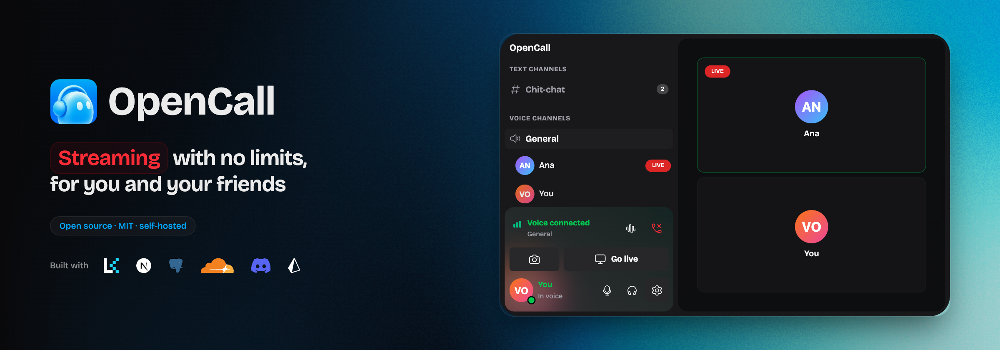

# OpenCall

OpenCall is a community platform with real-time voice, video, and text
channels — built for anyone who wants the Discord/TeamSpeak experience
running on their own infrastructure, with full control over data and access.
Discord is used only as a login method (OAuth), not as where the community
lives.

- Dynamic voice and text channels, manageable by admins;
- Real-time voice and video;
- Screen or window sharing;
- Chat with attachments, GIFs, presence, and live typing indicators;
- Invite links, role-based access control;

## Documentation

Documentation site for [OpenCall](https://github.com/pedroflp/OpenCall).

## Development

#### Stack


#### How to run local

`docker compose` spins up Postgres, [MinIO](https://min.io) (S3-compatible,
replaces R2) and LiveKit — the only thing left to configure by hand is
Discord OAuth, since it depends on an app registered with Discord and can't
be containerized.

1. Create an app at [discord.com/developers/applications](https://discord.com/developers/applications),
   add the redirect `http://localhost:3000/api/auth/callback/discord`, and
   copy the Client ID/Secret.
2. The first user to log in automatically becomes ADMIN (empty database) —
   so make that first login with your own Discord account.

```bash
pnpm install
cp .env.docker.example .env   # fill in DISCORD_CLIENT_ID/SECRET
pnpm dev:docker                # spins up infra (docker compose --wait) + migrates + starts Next.js
```

`pnpm dev:docker` runs `pnpm docker:up` (Postgres/MinIO/LiveKit) +
`prisma migrate dev` + `pnpm dev`. Run `pnpm docker:down` when you're done.

## License

MIT — see [LICENSE](./LICENSE).
